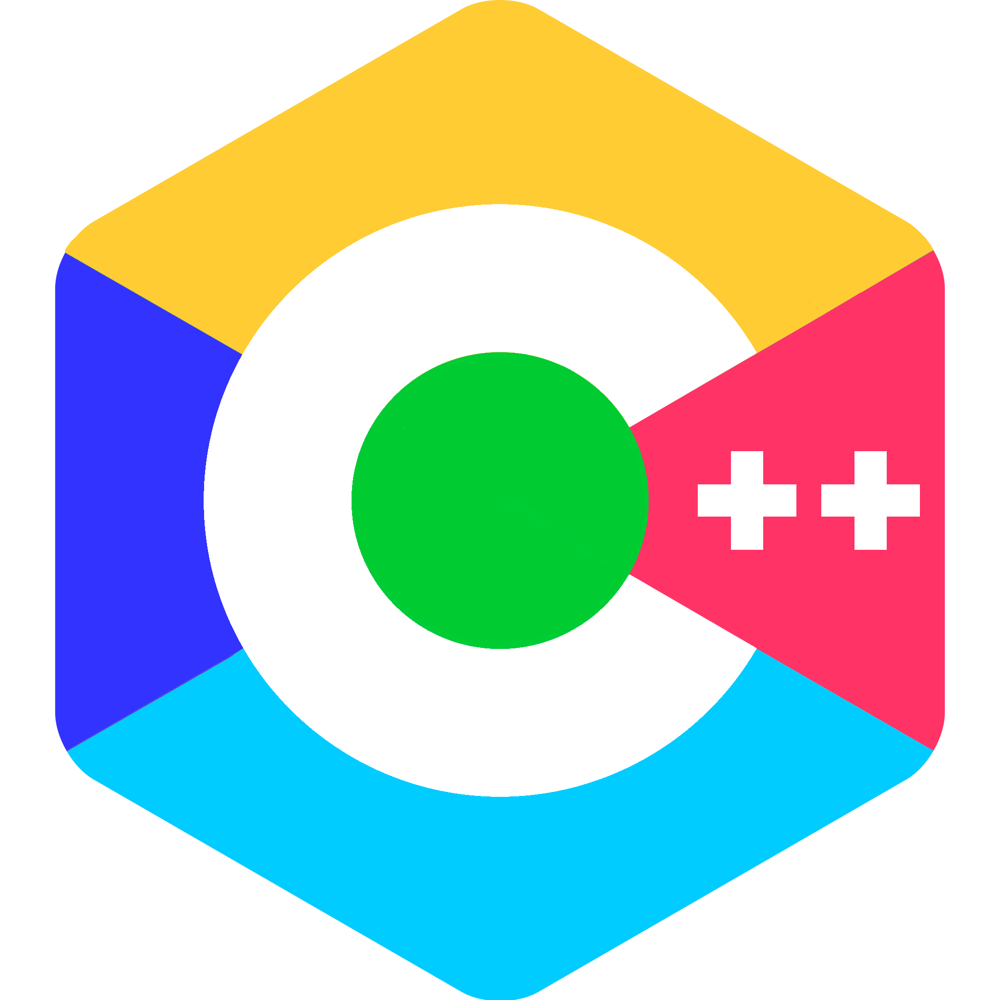

# flixel++

flixel++ is a port of Adam "Atomic" Saltsman's Flixel library originally created for ActionScript 3.

flixel++ is a work in progess, things might change or break.

# Building
Refer to BUILDING.md for instructions.